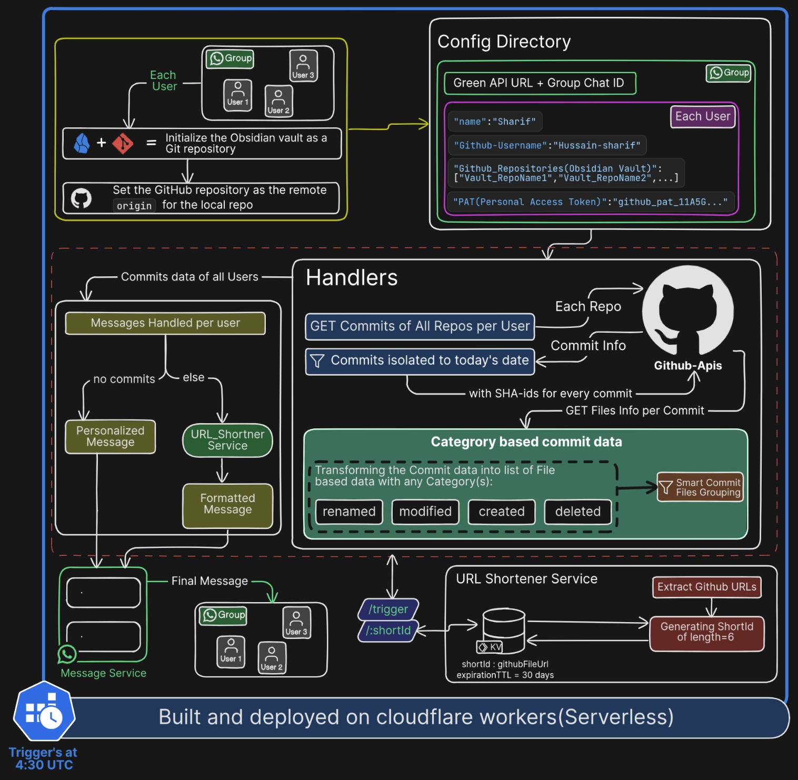

# Obsidian WhatsApp Automation (OWA) 🤖📱

> **Automated daily GitHub commits of Obsidian Vaults tracking sent directly to WhatsApp** — Built on **Cloudflare Workers** for serverless scalability.

[](https://workers.cloudflare.com/)
[](https://www.typescriptlang.org/)
[](https://hono.dev/)
[](https://developers.cloudflare.com/kv/)

---
## Deployed: [owa.hxnsharif.xyz](https://owa.hxnsharif.xyz/) 

## 🎯 What is OWA?

OWA is a **fully automated serverless bot** that:

- 📊 **Tracks daily commits** across multiple GitHub repositories for multiple users
- 📝 **Formats commits intelligently** (groups by status: created/modified/renamed)
- 🔗 **Auto-shortens URLs** to reduce WhatsApp message clutter (30-day TTL)
- 💬 **Sends daily reports** to WhatsApp at a scheduled time via **Green API**
- 😊 **Sends personalized messages** to users who didn't commit (customizable)
- ⚡ **Runs serverless** on Cloudflare Workers with **zero infrastructure cost**

Perfect for **team standups**, **open-source tracking**, **personal accountability** or **Encouraging Peer Learnings via daily Obsidian notes tracking**.

---

## 🚀 Key Features

### ✨ Smart Commit Aggregation
- Fetches commits from **multiple repos per user** in parallel
- Filters to **today's commits only** using timezone-aware date logic
- Groups file changes by status: `renamed`, `modified`, `created`, `deleted`
- Automatically filters out config folders (`.obsidian`, `.png` files)

### 🔐 GitHub Integration
- Supports **multiple GitHub users** with different PATs (Personal Access Tokens)
- Uses official **GitHub REST API** with proper authentication 
- Handles **API rate limits** gracefully with error fallbacks 
- Insight: Commit data is in newest-first order

### 🌍 URL Shortening Service
- Custom-built URL shortener using **Cloudflare KV** storage
- **Deduplication**: Same GitHub URL always generates same short link
- **Bidirectional mapping**: Both `shortId → longUrl` and `longUrl → shortId`
- **30-day auto-expiry** to prevent storage bloat
- **Base36 encoding** for compact, case-insensitive short IDs

### 📱 WhatsApp Integration
- Sends formatted reports to **WhatsApp groups** via **Green API**
- **Parallel message sending** (no sequential delays)
- **Personalized fallback messages** for inactive users
- **Error notifications** sent to WhatsApp if bot fails

### ⏰ Scheduled Automation
- **Cron trigger**: Runs daily at **4:30 PM UTC** (10:00 PM IST)
- **Test endpoint**: `/test-cron` for development (requires `ENVIRONMENT=development`)
- **Manual HTTP trigger**: Call `/trigger` to trigger immediately

### 🛠️ Developer Features
- **Full TypeScript** with strict type safety
- **Zero dependencies** on runtime libraries (uses Cloudflare native APIs)
- **Comprehensive error handling** with WhatsApp alerts
- **Local development support** with hot reload

---

## 📋 Architecture


---

## 🛠️ Tech Stack

| Component | Technology | Why |
|-----------|-----------|-----|
| **Runtime** | Cloudflare Workers | Zero-cost, global edge, millisecond latency |
| **Framework** | Hono.js | Lightweight (~12KB), edge-optimized |
| **Storage** | Cloudflare KV | Globally distributed, <10ms reads |
| **Language** | TypeScript | Type safety, excellent DX |
| **Date Handling** | date-fns | Timezone-aware commit filtering |
| **GitHub** | REST API v3 | Official, well-documented |
| **WhatsApp** | Green API | Reliable bot API service |
| **Deployment** | Wrangler CLI | Official Cloudflare deployment tool |

---

## 📦 Installation & Setup

### Prerequisites
- Node.js 18+ and npm/pnpm
- Cloudflare account (free tier works!)
- GitHub Personal Access Token(s)
- Green API WhatsApp account

### 1. Clone & Install

```bash
git clone https://github.com/Hussain-Sharif/Obsidian-Whatsapp-Automation.git
cd Obsidian-Whatsapp-Automation
npm install
```

### 2. Configure Environment Variables

Create `.dev.vars` for local development:

```bash
ENVIRONMENT=development
GITHUB_USERS='[
  {
    "username": "your-github-username",
    "name": "Your Name",
    "repositories": ["repo1", "repo2", "repo3"],
    "pat": "ghp_your_personal_access_token"
  },
  {
    "username": "team-member-username",
    "name": "Team Member",
    "repositories": ["repo1","repo2"],
    "pat": "ghp_their_personal_access_token"
  }
]'
BOT_GREEN_API_URL=https://1234.api.green-api.com/waInstance1234/{method}/yourapitoken
WHATSAPP_CHAT_ID=1234567890@g.us
WORKER_URL=http://localhost:8787
```

**GITHUB_USERS Format:**
```json
{
  "username": "github-username",        // GitHub username
  "name": "Display Name",               // Name shown in message
  "repositories": ["repo1", "repo2"],   // Repos to track
  "pat": "ghp_xxxxx"                    // GitHub Personal Access Token
}
```

### 3. Update wrangler.jsonc

```jsonc
{
  "name": "owa",
  "main": "src/index.ts",
  "kv_namespaces": [{
    "binding": "URL_SHORTENER",
    "id": "your-kv-namespace-id",        // From: wrangler kv:namespace create
    "preview_id": "your-preview-kv-id"   // For local development
  }],
  "triggers": {
    "crons": ["30 16 * * *"]  // Daily at 4:30 PM UTC (10:00 PM IST)
  }
}
```

### 4. Create KV Namespace

```bash
# Production
npx wrangler kv:namespace create "URL_SHORTENER"

# Development/Preview
npx wrangler kv:namespace create "URL_SHORTENER" --preview
```

Copy the returned IDs into `wrangler.jsonc`.

### 5. Deploy to Cloudflare

```bash
# Development server (local)
npx wrangler dev

# Production deployment
npx wrangler deploy
```

### 6. Test Locally

```bash
# If ENVIRONMENT=development, this endpoint works:
curl http://localhost:8787/test-cron
```

---

## 📚 API Endpoints

### `GET /trigger`
**Triggers the main commit tracking and sends WhatsApp message.**

```bash
curl https://owa.your-subdomain.workers.dev/trigger
```

Response:
```json
{
  "data": [
    {
      "statusCode": 200,
      "userName": "user1",
      "allReposPerUser": [
        {
          "statusCode": 200,
          "repoName": "myObisidanVaultRepo1",
          "commits": {
            "created": [
                {
                "fileStatus": "",
                "fileUrl": "",
                "fileCommitDateTime": "",
                "fileCommitMessage": "",
                "fileName": ""
              }
            ],
            "modified": [...],
            "renamed": [...]
          }
        },
        {
          "statusCode": 200,
          "message": "No Commits Today Made from myObisidanVaultRepo2 by user1"
        }
      ]
    },{
        "statusCode":200,
        "userName":"user2",
        "allReposPerUser":[...]
    }
  ],
  "result": "Formatted WhatsApp message sent successfully"
}
```

### `GET /test-cron` (Development Only)
**Manually trigger the scheduled task.**

Only works when `ENVIRONMENT=development`.

```bash
curl http://localhost:8787/test-cron
```

### `GET /:shortId`
**Redirect shortened URL to original GitHub URL.**

```bash
curl https://owa.your-subdomain.workers.dev/abc123
# Redirects to original GitHub URL with 302 status
```

---

## 🔄 Workflow

### Daily Execution (4:30 PM UTC / 10:00 PM IST)

1. **Cron triggers** the `scheduled()` handler
2. **Fetch commits** from all users' repos (parallel)
3. **Filter to today** using timezone-aware date logic
4. **Get file details** per commit (parallel API calls)
5. **Smart grouping** by file status (renamed/modified/created)
6. **Check for no-commits** and handle separately
7. **Format message** with file listings
8. **Shorten URLs** using KV storage (deduplication)
9. **Send to WhatsApp** via Green API
10. **Log errors** to WhatsApp if anything fails

### Example WhatsApp Output

```
User1
Renamed:
1. Automation-Learnings/cronjob.md - learned new concept in automation 
https://owa.workers.dev/abc123 

Added:
1. future-proof-skills.md - got some new skills 
https://owa.workers.dev/def456 

Modified:
1. project-learnings/OWA.md - learned abt URL shortnering
https://owa.workers.dev/ghi789

---

User2
No commits detected. Keep coding! 💻
```

---

## 🔧 Configuration Options

### Environment Variables

| Variable | Required | Format | Example |
|----------|----------|--------|---------|
| `ENVIRONMENT` | Yes | `development` \| `production` | `production` |
| `GITHUB_USERS` | Yes | JSON string | See above |
| `BOT_GREEN_API_URL` | Yes | URL template | `https://xxx.api.green-api.com/waInstanceXXX/{method}/TOKEN` |
| `WHATSAPP_CHAT_ID` | Yes | Chat ID | `1234567890@g.us` |
| `WORKER_URL` | Yes | Worker URL | `https://owa.your-subdomain.workers.dev` |
| `URL_SHORTENER` | Yes | KV Binding | Auto-injected by Wrangler |

### Cron Schedule

Edit in `wrangler.jsonc`:
```jsonc
"triggers": {
  "crons": ["30 16 * * *"]  // Cron syntax: minute hour day month weekday
}
```

**Common schedules:**
- `0 9 * * *` → 9:00 AM UTC daily
- `30 10 * * 1` → 10:30 AM UTC every Monday
- `0 0 * * *` → Midnight UTC daily

---

## 📊 URL Shortener Details

### How It Works

1. **Extracts** all GitHub URLs from formatted message using regex
2. **Checks KV** for existing short ID via reverse mapping
3. **If found** → Returns existing short ID (deduplication)
4. **If not** → Generates random 6-char Base36 ID
5. **Stores bidirectionally**:
   - `shortId → originalUrl` (for redirects)
   - `reverse:originalUrl → shortId` (for deduplication)
6. **Replaces** URLs in message with short versions

### Deduplication Example

```typescript
// Day 1: Shorten GitHub URL
// KV stores: "abc123" → "https://github.com/Hussain-Sharif/..."
//            "reverse:https://github.com/..." → "abc123"

// Day 2: Same file modified, same URL appears again
// Lookup: "reverse:https://github.com/..." → Returns "abc123"
// Result: Same short link, no duplicate entries
```

### Storage & Expiry

- **KV Namespace**: `URL_SHORTENER`
- **TTL**: 30 days (auto-cleanup)
- **Size**: ~50 bytes per entry
- **Cost**: Free (Cloudflare KV free tier: 100K reads/day)

---

## 🎨 Customization

### Change No-Commits Messages

Edit `src/libs/noCommitsMessages.ts`:

```typescript
export const PERSONALIZED_NO_COMMITS_MESSAGES: string[] = [
  "{name} is on holiday today",
  "{name} is catching up on PRs",
  "{name} is in a meeting",
  // Add your own...
];
```

### Filter More File Types

In `src/libs/format_to_text.ts`, add to the filter:

```typescript
.filter((file: any) => 
  !file.fileName.toLowerCase().endsWith(".png") &&
  !file.fileName.toLowerCase().endsWith(".jpg") &&
  !file.fileName.includes(".obsidian")
)
```

### Change Cron Time

In `wrangler.jsonc`:

```jsonc
"triggers": {
  "crons": ["0 9 * * *"]  // 9:00 AM UTC = 2:30 PM IST
}
```

---

## 🐛 Troubleshooting

### "KV binding not found"
- Ensure `wrangler.jsonc` has correct KV namespace binding name: `URL_SHORTENER`
- For dev: Include `preview_id` in KV config
- Restart dev server: `npx wrangler dev`

### "GITHUB_USERS parse error"
- Validate JSON format: Use [jsonlint.com](https://jsonlint.com)
- Ensure all required fields present: `username`, `name`, `repositories`, `pat`
- Check PAT is valid and has `repo` scope

### "No commits detected" (but you made commits)
- Commits must be from **today** (UTC timezone)
- Check commit author email matches GitHub username
- Verify PAT has `repo` scope

### WhatsApp message not received
- Verify `BOT_GREEN_API_URL` format ends with `/{method}`
- Check `WHATSAPP_CHAT_ID` is valid (must be `@g.us` for group)
- Test Green API directly with Postman/Bruno

### URL shortening not working
- Check KV namespace ID in `wrangler.jsonc`
- Ensure KV has `preview_id` for dev mode
- Verify message has valid GitHub URLs matching regex: `https://github.com/[^\s)]+`

---

## 📊 Performance Metrics

| Operation | Time | Notes |
|-----------|------|-------|
| Fetch all commits | ~500ms | Parallel for all users |
| Get file details | ~800ms | Parallel per commit SHA |
| Format message | ~100ms | String operations |
| Shorten URLs | ~200ms | KV lookups + writes |
| Send WhatsApp | ~1s | Network to Green API |
| **Total** | ~2.6s | End-to-end |

---

## 🔐 Security Considerations

### ✅ What's Secure
- **GitHub PATs** stored only in Cloudflare's encrypted environment
- **KV data** encrypted at rest on Cloudflare's servers
- **HTTPS-only** communication with GitHub and Green API
- **No database**: All data ephemeral or self-destructing (30-day TTL)

### ⚠️ What to Protect
- Never commit `.dev.vars` or `wrangler.jsonc` with real secrets
- Rotate GitHub PATs regularly (test in `.gitignore`)
- Use `--local false` flag in prod to prevent local caching
- Monitor Green API token rotation policy

---
<!-- 
## 🤝 Contributing

Contributions welcome! Areas for improvement:
- [ ] Support Slack/Discord integration
- [ ] Add scheduling flexibility (multiple daily runs)
- [ ] Store commit history for weekly/monthly reports
- [ ] Add D1 database for analytics
- [ ] Create web dashboard for viewing reports

--- -->

## 📝 License

MIT License — Free to use and modify

---

## 🙋 Support

**Issues?** Open a GitHub issue with:
- Environment (dev/prod)
- Error message from Worker logs
- Relevant `.dev.vars` (without secrets)
- Steps to reproduce

**Questions?** Check:
1. [Cloudflare Workers Docs](https://developers.cloudflare.com/workers/)
2. [Hono Docs](https://hono.dev/)
3. [GitHub API Docs](https://docs.github.com/en/rest)
4. [Green API Docs](https://greenapi.com/en/docs/)

---

## 🎉 Credits

Built with ❤️ by **Hussain Sharif** for automated team accountability.

Inspired by daily standups and the need for **zero-infrastructure automation**.

---

**⭐ If this helped, please star the repo!**